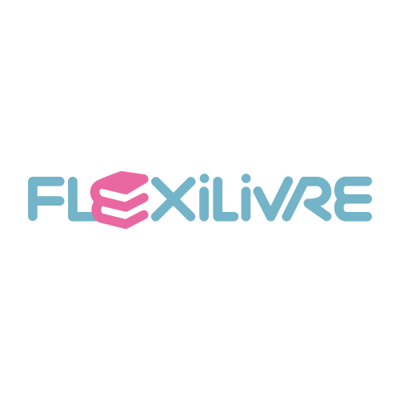
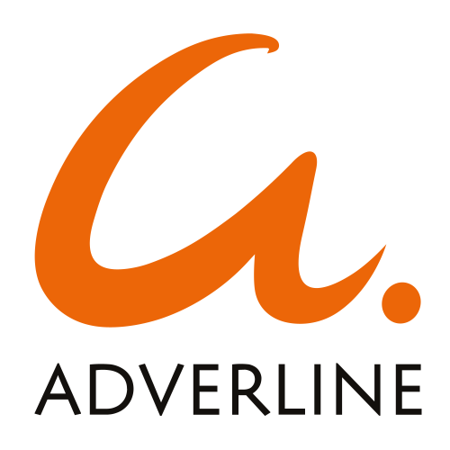

# Hello

## Experience
Passionate about all things Web and AdTech, hands-on, I thrive at solving problems and discovering new tools and technologies. Don't talk to me about frameworks :wink:

You can find my resume [here](https://drive.google.com/file/d/1rqaVs7pZaBPjcxD-yya7chfwUTTpEHQ3/view?usp=drive_link).

| | | | |
|:--:|:--:|:--:|:--:|
| </img> | [My Little Paris](https://www.mylittleparis.com) | CTO | 2023- |
| </img> | [FlexiLivre](https://www.flexilivre.com) | Associate & Technical Advisor | 2015- |
| </img> | [Qwarry](https://www.qwarry.com) | VP Engineering | 2021-2022 |
| </img> | [Les Echos](https://www.lesechos.fr) | Product Owner | 2020-2021 |
| </img> | Adverline | CTO | 2010-2020 |
| </img> | Adverline | Technical Lead | 2007-2010 |
| </img> | Adverline | Multimedia Project Manager | 2003-2007 |

## Skills
### Everyday

### Amazon

### Google

### Microsoft

### Adobe

